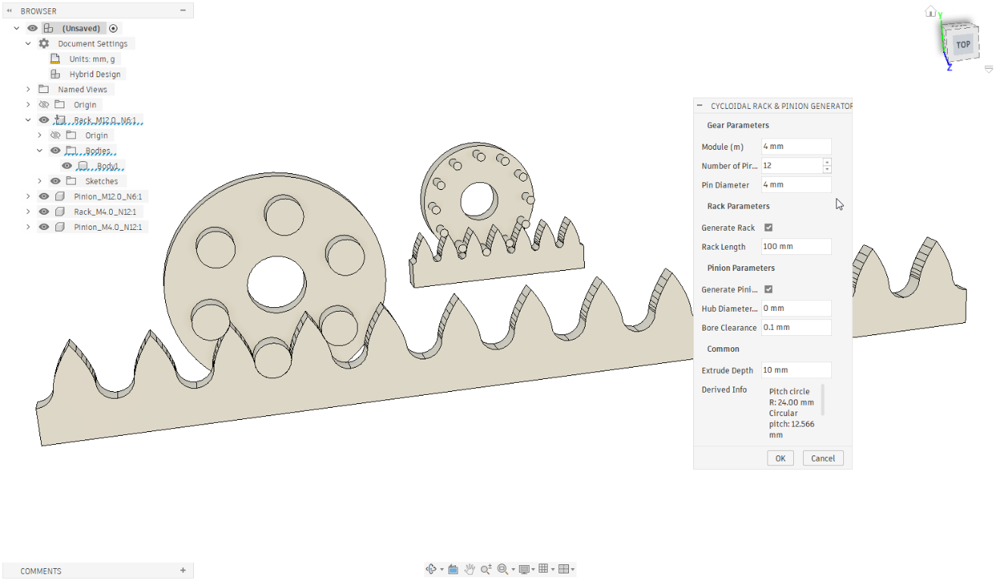

# Cycloidal Rack and Pinion Generator

A Fusion 360 Python add-in that generates mathematically correct cycloidal rack-and-pinion geometry — the same drive system used in high-precision linear motion products (Nexen, Güdel).



---

## What it generates

| Part | Description |
|------|-------------|
| **Rack** | Trochoid flank profile approximated by a chain of circular arcs (8 arcs per flank), G1-continuous with the concave valley arc at the pitch line. Patterned along X for the requested length. |
| **Pinion** | Annular carrier disc with N solid cylindrical pins on the pitch circle. Pins are extruded in a single Join operation — no circular pattern API required. |

Both parts are created as separate components in the active design. The rack sits with its pitch line at Z = 0; the pinion's pin centres are at X = 0, Y = R\_pc.

---

## Parameters

| Parameter | Description |
|-----------|-------------|
| **Module (m)** | Gear module in mm. Controls tooth size and pitch. |
| **Number of Pins (N)** | Number of roller pins on the pinion (≥ 6). |
| **Pin Diameter** | Diameter of each cylindrical pin in mm. Must satisfy `r_pin < π·m / 4`. |
| **Rack Length** | Total length of rack to generate (actual length rounded to whole teeth). |
| **Hub Diameter** | Inner bore of the pinion carrier disc (0 = auto, set to 40 % of pitch circle radius). |
| **Bore Clearance** | Radial clearance added to the hub bore (default 0.1 mm). |
| **Extrude Depth** | Extrusion thickness in Z for both rack and pinion (mm). |

The **Derived Info** panel shows the pitch circle radius, circular pitch, and tooth count in real time as you edit.

---

## Installation

1. Copy (or clone) this folder into your Fusion 360 add-ins directory:
   ```
   %APPDATA%\Autodesk\Autodesk Fusion 360\API\AddIns\
   ```
2. In Fusion 360, open **Tools → Add-Ins → Scripts and Add-Ins**.
3. On the **Add-Ins** tab, find **Cycloid Rack and Pinion** and click **Run**.
4. The command appears in the **Solid → Create** menu (next to Spur Gear) and is promoted to the toolbar.

To load automatically on startup, tick **Run on Startup** in the Add-Ins dialog.

---

## Usage

1. Switch to the **Design** workspace with an active document open.
2. Click **Cycloidal Rack & Pinion Generator** in the Create menu (or toolbar).
3. Set your parameters, confirm with **OK**.
4. Two new components appear: `Rack_M…_N…` and `Pinion_M…_N…`.

You can uncheck either **Generate Rack** or **Generate Pinion** to create only one part.

---

## Geometry tests

The `tests/test_geometry.py` script validates all math without Fusion 360. It stubs the `adsk` modules, so it runs with a plain Python interpreter.

### Run tests (no dependencies)

```bash
cd "path\to\Cycloid Rack and Pinion"
python tests/test_geometry.py
```

All 20 tests should print `[PASS]`.

### Run tests with profile plot (requires matplotlib)

Create a virtual environment and install matplotlib:

```bash
cd "path\to\Cycloid Rack and Pinion"

# Create the venv
python -m venv .venv

# Activate (Windows)
.venv\Scripts\activate

# Install matplotlib (numpy comes with it)
pip install matplotlib

# Run with plot
python tests/test_geometry.py --plot
```

The plot is saved as `tooth_profile.png` in the project root. It overlays the 8-arc chain approximation (blue) against the true trochoid (red dashed) so you can verify the fit.

---

## Geometry notes

- **Rack flank** — curtate cycloid (offset trochoid): the locus of a point at distance `r_pin` from the centre of a circle of radius `R_pc` rolling along the pitch line.
- **Valley arc** — concave circular arc, radius `r_valley`, tangent-continuous (G1) with the first flank arc. The arc centre lies on `y = 0`, which forces the shared tangent to be vertical at the junction.
- **Arc chain** — 8 circular arcs per flank fitted by three-point circumscription of evenly-spaced trochoid samples. The first arc's centre is constrained to `y = 0` for G1.
- **Validity** — requires `r_pin < π·m / 4` to avoid valley/flank overlap, and pins must not overlap on the pitch circle.

---

## File structure

```
Cycloid Rack and Pinion/
├── Cycloid Rack and Pinion.py        # Add-in entry point (run/stop)
├── Cycloid Rack and Pinion.manifest
├── config.py                         # Company/add-in name constants
├── commands/
│   └── commandDialog/
│       └── entry.py                  # Dialog, handlers, lifecycle
├── lib/
│   ├── cycloid_geometry.py           # Pure-math: trochoid, arc chain, pinion spec
│   ├── fusion_geometry.py            # Fusion API helpers (sketch, extrude, pattern)
│   ├── rack_generator.py             # Builds rack sketch + extrude + pattern
│   └── pinion_generator.py          # Builds disc + pins extrude
└── tests/
    └── test_geometry.py              # 20 standalone geometry tests + matplotlib plot
```
